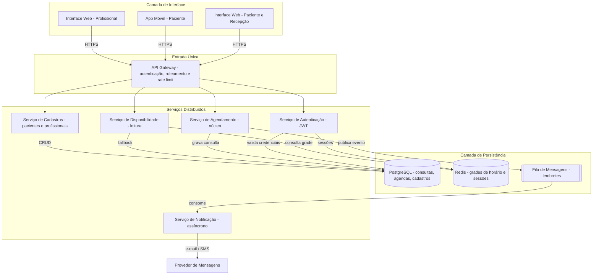
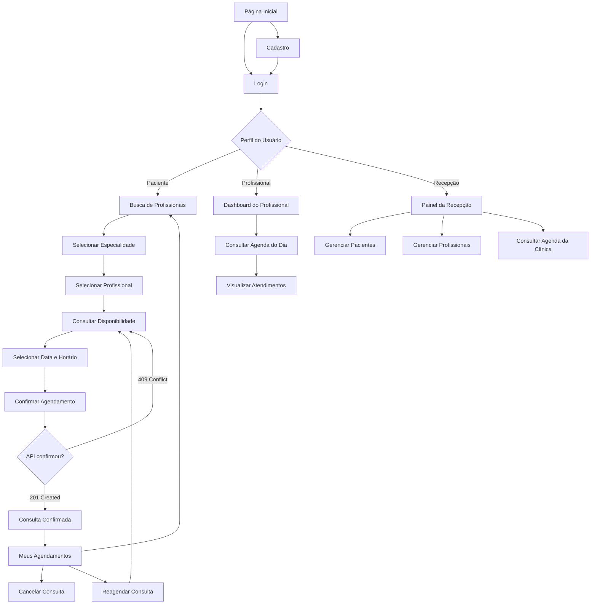
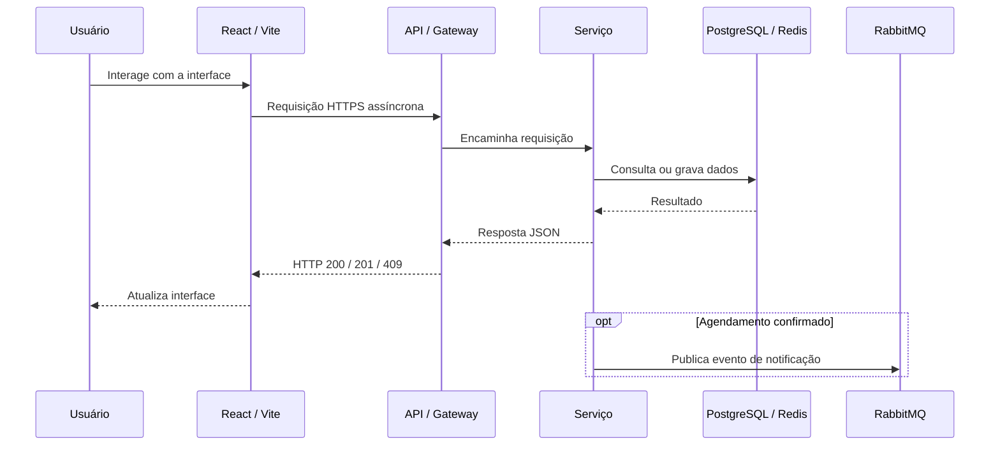
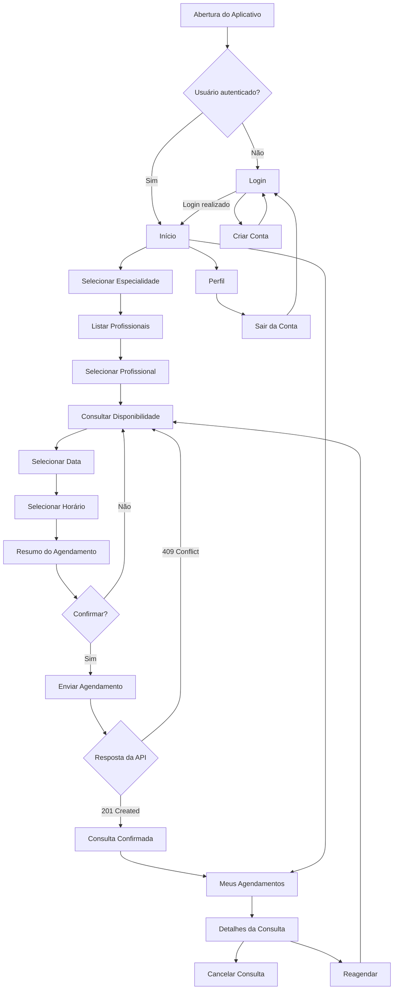

# 🏗️ Etapa 1: Contexto e Planejamento da Solução Distribuída

Este documento serve como diretriz mestre e repositório de evidências para a **Etapa 1: Contexto e Planejamento da Solução**. Ele foi estruturado de forma a facilitar o acompanhamento e auto-gestão das atividades pelos alunos.

---

## 🎯 Rubricas de Avaliação desta Etapa

Ao final desta Etapa, cada aluno será avaliado individualmente nestas 5 competências:

1. **H34a-SI-G: Gerenciar e documentar serviços de TI**: Gerenciar e documentar serviços de TI, de forma clara e objetiva (Medido na seção [Catálogo de Serviços Web](#-catalogo-de-servicos-web)).
2. **H35a-SI-G: Planejar, desenvolver e gerenciar uma arquitetura de aplicação distribuída**: Planejar e documentar uma arquitetura de aplicação distribuída, de forma clara e objetiva (Medido na seção [Arquitetura da Solução](#-arquitetura-da-solucao)).
3. **H36a-SI-G: Planejar, desenvolver e gerenciar APIs e Web Services**: Planejar e documentar APIs e Web Services, de forma clara e objetiva (Medido na seção [Especificação de Contratos de APIs](#-especificacao-de-contratos-de-apis)).
4. **H37a-SI-G: Planejar, desenvolver e gerenciar uma aplicação Web**: Planejar e documentar uma aplicação Web, de forma clara e objetiva (Medido na seção [Projeto do Frontend Web](#-projeto-do-frontend-web)).
5. **H38a-SI-G: Planejar, desenvolver e gerenciar uma aplicação móvel**: Planejar e documentar uma aplicação móvel, de forma clara e objetiva (Medido na seção [Projeto do Frontend-Movel](#-projeto-do-frontend-movel)).

---

## 📅 Cronograma do Semestre (Semana → Período)

Esta tabela é a referência única de planejamento semanal do projeto, usada por todas as Etapas. Ela usa **número relativo de semana** (Semana 1, Semana 2...), não datas fixas, para que o template continue válido em qualquer semestre — cada turma ancora a "Semana 1" na semana real de início da disciplina.

| Semana | Etapa | Atividade Prevista |
| :---: | :---: | :--- |
| 1 | 1 | Apresentação do Projeto |
| 2 | 1 | Definição dos Temas e Organização dos Grupos |
| 3 | 1 | Especificações do Projeto |
| 4 | 1 | Arquitetura da Solução |
| 5 | 2 | Desenvolvimento de Funcionalidades - API (inclui apresentação da Etapa 1) |
| 6 | 2 | Desenvolvimento de Funcionalidades - API |
| 7 | 2 | Desenvolvimento de Funcionalidades - API |
| 8 | 2 | Desenvolvimento de Funcionalidades - API |
| 9 | 2 | Testes - API |
| 10 | 3 | Desenvolvimento de Funcionalidades - Web (inclui apresentação da Etapa 2) |
| 11 | 3 | Desenvolvimento de Funcionalidades - Web |
| 12 | 3 | Desenvolvimento de Funcionalidades - Web |
| 13 | 3 | Testes - Front-End Web |
| 14 | 4 | Desenvolvimento de Funcionalidades - Mobile (inclui apresentação da Etapa 3) |
| 15 | 4 | Desenvolvimento de Funcionalidades - Mobile |
| 16 | 4 | Desenvolvimento de Funcionalidades - Mobile |
| 17 | 4 | Testes - Front-End Mobile |
| 18 | 5 | Apresentação Final do Projeto |

*As Semanas 1 e 2 não possuem tarefa de documentação associada (organização inicial do grupo e apresentação do projeto).*

---

## 📅 QUADRO DE CONTRIBUIÇÃO REAL (ETAPA 1)

**Atenção alunos:** Preencham esta tabela para atualizar o andamento das tarefas e quem foi o responsável por cada entrega. Garanta que o nome, usuário do GitHub e o link para a seção onde está o seu trabalho estejam devidamente preenchidos.

- **Status admitidos**: `⌛ Não Iniciado` | `📝 Em Progresso` | `✔️ Entregue`
- **Autoria Git**: Indica se há commits desse estudante modificando a seção correspondente.

**Atividades Semanais desta Etapa** (ver [Cronograma do Semestre](#-cronograma-do-semestre-semana--periodo)):
- `ATV1.1` — Especificações do Projeto (Semana 3)
- `ATV1.2` — Arquitetura da Solução (Semana 4)

| Rubrica Curricular | ID Tarefa | Atividade Semanal | Descrição Detalhada da Tarefa | Estudante Responsável | GitHub Username | Status de Entrega | Evidência/Seção Temática | Autoria Git |
| :---: | :---: | :---: | :--- | :--- | :---: | :---: | :--- | :---: |
| **H34a** | `T1.1` | `ATV1.1` | Definição do Problema, Objetivos e Justificativa | Raphael Henrique Cunha Faria | `RaphaelHCF` | `✔️ Entregue` | [Seção 1](#11-problema-objetivos-e-justificativa) | [ ] |
| **H34a** | `T1.2` | `ATV1.1` | Descrição das Personas e Mapa de Stakeholders | Raphael Henrique Cunha Faria | `RaphaelHCF` | `✔️ Entregue` | [Seção 1.2](#12-personas-e-stakeholders) | [ ] |
| **H34a** | `T1.3` | `ATV1.1` | Definição de Requisitos Funcionais e Priorização | Elias Marques Fonseca Mesquita Silva | `eliasfonseca-dev` | `✔️ Entregue` | [Seção 2.1](#21-requisitos-funcionais-e-não-funcionais) | [ ] |
| **H34a** | `T1.4` | `ATV1.1` | Catálogo de Serviços Web e Acordos de SLA | Davi Perrier Cabral | `daavipc` | `✔️ Entregue` | [Seção 3.0](#-catalogo-de-servicos-web) | [ ] |
| **H35a** | `T1.5` | `ATV1.2` | Diagrama de Componentes Físico e Lógico da Solução | Davi Perrier Cabral | `daavipc` | `✔️ Entregue` | [Seção 4.1](#41-diagrama-de-arquitetura) | [ ] |
| **H35a** | `T1.6` | `ATV1.2` | Definição das Tecnologias Distribuídas e Hospedagem | Raphael Henrique Cunha Faria | `RaphaelHCF` | `✔️ Entregue` | [Seção 4.2](#42-tecnologias-e-hospedagem) | [ ] |
| **H36a** | `T1.7` | `ATV1.2` | Especificação de Contratos de API (Endpoints/Verbos) | Davi Perrier Cabral | `daavipc` | `✔️ Entregue` | [Seção 5.0](#-especificacao-de-contratos-de-apis) | [ ] |
| **H37a** | `T1.8` | `ATV1.2` | Wireframes do Frontend Web e Fluxograma de Navegação | Elias Marques Fonseca Mesquita Silva | `eliasfonseca-dev` | `✔️ Entregue` | [Seção 6.0](#-projeto-do-frontend-web) | [ ] |
| **H38a** | `T1.9` | `ATV1.2` | Wireframes do Frontend Móvel e Fluxo de Gestos | Pedro Henrique Valente Paulino | `PedroValenteIHS` | `✔️ Entregue` | [Seção 7.0](#-projeto-do-frontend-movel) | [ ] |

---

# 1. Introdução e Contexto

A transformação digital no setor de saúde tem impulsionado a modernização de processos operacionais básicos, tornando a experiência de atendimento mais ágil, acessível e integrada. Tradicionalmente, o fluxo de marcação de consultas médicas depende de canais manuais e centralizados, como chamadas telefônicas e atendimentos presenciais em balcão. Esse modelo analógico gera sobrecarga nas equipes de recepção, limita o agendamento ao horário comercial e perpetua altos índices de absenteísmo (no-show), resultando em ociosidade na infraestrutura clínica e atrasos na assistência aos pacientes.

Para mitigar essas limitações, este projeto propõe o desenvolvimento de uma solução de software distribuída voltada à gestão e ao agendamento de consultas. A arquitetura conecta múltiplos pontos de contato — uma interface Web voltada à administração e controle da grade de horários pelas clínicas e um aplicativo Móvel voltado ao autoatendimento e comodidade do paciente — a um backend centralizado via APIs RESTful seguras.

O sistema estabelece um ecossistema interoperável capaz de gerenciar a concorrência de horários em tempo real, automatizar confirmações e lembretes por mensageria e garantir alta disponibilidade. Dessa forma, a solução otimiza a ocupação das agendas médicas, simplifica a jornada do paciente e reduz custos operacionais por meio de uma infraestrutura moderna, escalável e resiliente.

## 1.1. Problema, Objetivos e Justificativa

* **O Problema**:
O fluxo tradicional de agendamento de consultas médicas e multiprofissionais ainda enfrenta gargalos críticos como a dependência de canais síncronos e manuais (telefone e balcão), assimetria de visibilidade de agendas livres em tempo real, e altos índices de abstenção não comunicada (no-show). Do ponto de vista dos profissionais e clínicas, a descentralização do controle de escalas e a ausência de confirmações automatizadas geram ociosidade de infraestrutura e sobrecarga na recepção. Do lado do paciente, a lentidão no processo de marcação, a dificuldade em cancelar ou reagendar fora do horário comercial e a falta de lembretes prévios resultam em atrasos no cuidado e desperdício de horários.

* **Objetivo Geral**:
Desenvolver e implementar uma solução distribuída para gestão e agendamento de consultas de saúde, integrando interfaces Web e Móvel a uma arquitetura orientada a microsserviços/APIs RESTful com suporte a atualizações em tempo real e notificações automáticas.

* **Objetivos Críticos Específicos (Mínimo de 3)**:
  1. Interoperabilidade/API distribuída: Projetar e implementar uma API RESTful única, com contratos padronizados (JSON sobre HTTPS, autenticação JWT), consumida de forma equivalente pelo cliente web e pelo cliente móvel, garantindo no serviço de agendamento o controle transacional necessário para impedir a dupla reserva de um mesmo horário.
  2. Experiência Web e Móvel: Entregar, no aplicativo móvel, um fluxo simplificado de busca, confirmação e cancelamento de consulta voltado ao paciente; e, na interface web, um painel para a recepção e para o profissional visualizarem e gerenciarem a agenda do dia.
  3. Infraestrutura e Resiliência: Arquitetar uma infraestrutura distribuída com desacoplamento de serviços assíncronos (fila de mensagens para lembretes/e-mails) e cache centralizado de leitura, assegurando tempo de resposta sub-segundo e disponibilidade contínua.

* **Justificativa**:
Taxas de no-show na área da saúde variam comumente entre 15% e 30%, gerando prejuízos financeiros para instituições e estendendo filas de espera para tratamentos essenciais. A automação distribuída do agendamento reduz a dependência de processos manuais, amplia a capacidade de atendimento 24/7, diminui faltas por meio de mensageria ativa de confirmação e confere escalabilidade ao negócio com baixo custo marginal de infraestrutura em nuvem.

---

## 1.2. Personas e Stakeholders

[As personas e stakeholders ajudam a desenhar as interfaces de usuário da aplicação distribuída (Web e Mobile).]

### Persona 1: Maria Souza
- **Perfil e Atitude**: 34 anos, professora do ensino fundamental, usa o celular o dia inteiro para tudo (banco, mercado, transporte), mas tem pouca paciência para processos burocráticos. Prefere resolver qualquer pendência entre uma aula e outra, muitas vezes fora do horário comercial.
- **Frustração com o Modelo Atual**: Precisa ligar para a clínica em horário comercial para marcar consulta, muitas vezes cai em espera longa ou liga fora do expediente e não consegue. Quando quer cancelar ou remarcar, enfrenta o mesmo problema — e às vezes esquece da consulta por falta de lembrete, perdendo a vaga. Além disso, depois de uma consulta ruim (atraso excessivo, atendimento apressado), não tem nenhum canal formal para registrar essa insatisfação — ou desabafa informalmente com a recepção, sem gerar efeito prático, ou simplesmente não volta mais àquele profissional, sem que a clínica saiba o motivo real.
- **Como a Solução o Ajuda**: Usa o aplicativo móvel para buscar profissional por especialidade, ver horários livres em tempo real e confirmar a consulta em poucos toques, a qualquer hora do dia. Recebe lembrete automático por notificação/SMS antes do horário marcado, reduzindo o esquecimento. Após a consulta ser marcada como realizada, o aplicativo pede que ela avalie o atendimento com uma nota e um comentário opcional, direto pelo histórico de agendamentos, sem precisar ligar ou ir até a recepção.

### Persona 2: Dra. Helena Martins
- **Perfil e Atitude**: 45 anos, dermatologista, atende em uma clínica de médio porte. Tem familiaridade básica com tecnologia (usa planilhas e WhatsApp), mas não tem tempo nem paciência para sistemas complexos — quer abrir a tela e ver a agenda do dia sem cliques desnecessários.
- **Frustração**: A agenda é controlada pela recepção em papel ou planilha isolada, então ela só sabe quem vai atender no dia quando chega à clínica. Cancelamentos de última hora não chegam até ela a tempo, gerando ociosidade não aproveitada. Também nunca sabe como os pacientes realmente avaliam seu atendimento — não existe um retorno estruturado, só reclamações esporádicas que chegam de forma indireta pela recepção, quando chegam.
- **Como a Solução o Ajuda**: Usa a interface Web para visualizar a agenda do dia atualizada em tempo real, com status de cada consulta (confirmada/cancelada) sem depender da recepção repassar a informação manualmente. Passa também a visualizar as avaliações e comentários deixados pelos pacientes após cada consulta, o que ajuda a identificar pontos de melhoria no próprio atendimento e a reforçar práticas bem avaliadas.

### Mapa de Interesses dos Stakeholders:
- **Stakeholders Diretos (Atores principais)**: Pacientes (app móvel), profissionais de saúde e equipe de recepção (interface Web).
- **Stakeholders Indiretos (Quem é alterado pelo sistema)**: Administradores da clínica (gestão de ocupação e redução de no-show), provedor de mensageria (SMS/e-mail de lembrete), equipe de infraestrutura/TI responsável por manter o Gateway, o banco de dados e a fila de notificações no ar.
---

# 2. Especificações do Projeto

## 2.1. Requisitos Funcionais e Não Funcionais

### Requisitos Funcionais (RF)

| ID | Descrição do Requisito | Canal Prático (Onde ocorre?) | Prioridade | Rubrica Associada |
| :-: | :--------------------- | :--------------------------: | :--------: | :---------------- |
| `RF-101` | [Permitir que o paciente pesquise profissionais por especialidade] | Web / Móvel | Alta | `H36a`, `H37a`, `H38a` |
| `RF-102` | [Permitir que o paciente visualize os horários disponíveis de um profissional] | Web / Móvel | Alta | `H36a`, `H37a`, `H38a` |
| `RF-103` | [Permitir que o paciente realize o agendamento de uma consulta em um horário disponível] | Web / Móvel / API | Alta | `H35a`, `H36a`, `H37a`, `H38a` |
| `RF-104` | [Permitir que o paciente cancele uma consulta previamente agendada] | Web / Móvel | Alta | `H36a`, `H37a`, `H38a` |
| `RF-105` | [Permitir a autenticação de pacientes, profissionais e funcionários da clínica] | Web / Móvel / API | Alta | `H35a`, `H36a`, `H37a`, `H38a` |
| `RF-106` | [Permitir que a recepção cadastre, consulte e atualize pacientes e profissionais] | Web | Alta | `H36a`, `H37a` |
| `RF-107` | [Permitir que a clínica configure os horários de atendimento e disponibilidade dos profissionais] | Web / API | Alta | `H36a`, `H37a` |
| `RF-108` | [Permitir que o profissional visualize sua agenda de consultas] | Web | Alta | `H36a`, `H37a` |
| `RF-109` | [Permitir que o profissional atualize o status de uma consulta, como agendada, realizada ou cancelada] | Web / API | Média | `H36a`, `H37a` |
| `RF-110` | [Enviar confirmação ao paciente após a realização de um agendamento] | API / Backend | Alta | `H34a`, `H35a` |
| `RF-111` | [Enviar lembretes automáticos antes do horário da consulta] | API / Backend | Média | `H34a`, `H35a` |
| `RF-112` | [Impedir que dois pacientes realizem agendamento para o mesmo profissional, data e horário] | API / Backend | Alta | `H35a`, `H36a` |
| `RF-113` | [Permitir que as aplicações Web e Móvel consumam as funcionalidades do sistema por meio da mesma API] | API / Backend | Alta | `H35a`, `H36a`, `H37a`, `H38a` |
| `RF-114` | [Permitir que o paciente avalie o atendimento após a consulta ser realizada] | Web / Móvel / API | Média | `H36a`, `H37a`, `H38a` |

> **Nota:** `RF-114` foi incluído após o fechamento da Etapa 1, em função do ingresso de um novo integrante à equipe, ampliando o escopo original do projeto.

### Requisitos Não Funcionais (RNF)

| ID | Descrição do Requisito Técnico | Categoria | Prioridade | Rubrica Associada |
| :-: | :----------------------------- | :-------: | :--------: | :---------------- |
| `RNF-201` | [O backend deve ser desenvolvido em Node.js utilizando NestJS e TypeScript] | Arquitetura | Alta | `H35a`, `H36a` |
| `RNF-202` | [A API deve permitir o consumo das funcionalidades pelas aplicações Web e Móvel] | Interoperabilidade | Alta | `H35a`, `H36a`, `H37a`, `H38a` |
| `RNF-203` | [Os dados persistentes do sistema devem ser armazenados em banco de dados PostgreSQL] | Persistência | Alta | `H35a` |
| `RNF-204` | [A aplicação Web deve ser desenvolvida utilizando React com Vite] | Tecnologia | Alta | `H37a` |
| `RNF-205` | [A aplicação móvel deve ser desenvolvida utilizando React Native com Expo] | Tecnologia | Alta | `H38a` |
| `RNF-206` | [O sistema deve utilizar RabbitMQ por meio do CloudAMQP para processamento assíncrono de confirmações e lembretes] | Mensageria | Alta | `H34a`, `H35a` |
| `RNF-207` | [A indisponibilidade temporária do serviço de notificações não deve impedir a realização de novos agendamentos] | Tolerância a Falhas | Alta | `H34a`, `H35a` |
| `RNF-208` | [O sistema deve impedir a criação de agendamentos duplicados para o mesmo profissional, data e horário] | Consistência | Alta | `H35a`, `H36a` |
| `RNF-209` | [O serviço de agendamento deve tratar requisições repetidas de forma idempotente] | Confiabilidade | Alta | `H35a`, `H36a` |
| `RNF-210` | [As requisições de consulta de agenda e disponibilidade devem possuir tempo de resposta inferior a 2 segundos em condições normais de operação] | Desempenho | Média | `H34a`, `H36a` |
| `RNF-211` | [A API, o PostgreSQL e o Redis devem ser hospedados no Render com deploy integrado ao GitHub] | Implantação | Alta | `H35a` |
| `RNF-212` | [A aplicação Web deve ser hospedada na Vercel com deploy contínuo integrado ao GitHub] | DevOps | Média | `H35a`, `H37a` |
| `RNF-213` | [O sistema deve utilizar Redis para armazenamento temporário e cache de dados que necessitem acesso rápido] | Desempenho | Média | `H35a` |
| `RNF-214` | [As senhas dos usuários devem ser armazenadas utilizando algoritmo seguro de hash e nunca em texto puro] | Segurança | Alta | `H35a`, `H36a` |
| `RNF-215` | [O acesso às funcionalidades protegidas da API deve exigir autenticação baseada em token] | Segurança | Alta | `H35a`, `H36a`, `H37a`, `H38a` |
| `RNF-216` | [O aplicativo móvel deve utilizar Expo Go durante o desenvolvimento e Expo Application Services para geração dos builds de distribuição] | Implantação | Média | `H38a` |

> **Observações de implementação (Etapa 2)**: durante o desenvolvimento do backend, três RNFs foram ajustadas em relação ao planejado — detalhes e justificativa na [Seção 2.2 do backend-apis.md](backend-apis.md#22-integracao-e-infraestrutura-distribuida):
> - `RNF-206`: a mensageria assíncrona foi implementada com um event bus em memória (`@nestjs/event-emitter`) em vez de RabbitMQ/CloudAMQP, por limitação de equipe/tempo. A interface de publicação/consumo foi desenhada para ser substituída por uma fila real sem reescrever a lógica de negócio.
> - `RNF-211`: o PostgreSQL está hospedado no **Supabase**, não no Render — decisão tomada para viabilizar um banco compartilhado gratuito entre a equipe mais rapidamente. A API em si ainda não foi implantada em nenhum provedor (não há cobrança de deploy prático na disciplina).
> - `RNF-213`: Redis não foi implementado — não há ainda um CRUD de Disponibilidade (`T2.3.4`) cujas consultas justifiquem cache de leitura.
---

# 3. Catálogo de Serviços Web

*(Esta seção atende diretamente à rubrica **H34a**)*

A solução foi decomposta em serviços independentes para que cada responsabilidade possa falhar, escalar e ser monitorada de forma isolada. A separação segue dois critérios: **criticidade** (o que não pode cair durante o horário de atendimento) e **natureza da operação** (síncrona, quando o usuário espera a resposta na tela, ou assíncrona, quando o processamento pode ocorrer em segundo plano).

O serviço de agendamento é o núcleo síncrono do sistema: ele precisa responder rápido e garantir que dois pacientes nunca reservem o mesmo horário. Já as notificações de confirmação e lembrete são assíncronas por natureza — o paciente não fica esperando o SMS chegar para concluir a marcação —, o que permite processá-las por fila e evita que uma indisponibilidade do provedor de mensagens derrube o agendamento.

| Serviço de TI | Canal de Comunicação | Nível de Serviço (SLA) Esperado | Mecanismo de Monitoração | Responsável |
| :--- | :---: | :---: | :--- | :---: |
| **Autenticação e Identidade** | REST / JSON sobre HTTPS | 99,5% de disponibilidade / resposta em < 1s | Log de tentativas de acesso e alerta de falhas consecutivas | Davi Perrier Cabral |
| **Agendamento (núcleo)** | REST / JSON sobre HTTPS | 99,5% de disponibilidade / resposta em < 2s | Health check a cada 60s e log de conflito de horário | Davi Perrier Cabral |
| **Consulta de Disponibilidade** | REST / JSON sobre HTTPS | Resposta em < 1s (leitura com cache) | Taxa de acerto do cache e tempo médio de resposta | Davi Perrier Cabral |
| **Cadastro de Pacientes e Profissionais** | REST / JSON sobre HTTPS | 99% de disponibilidade / resposta em < 2s | Log de auditoria de alteração de cadastro | Davi Perrier Cabral |
| **Notificação de Confirmação e Lembrete** | Fila de mensagens (assíncrono) | Envio em até 5 minutos após o gatilho | Fila de reprocessamento para mensagens não entregues | Davi Perrier Cabral |

**Observações sobre os acordos de nível de serviço:**

- Os SLAs valem para o horário de funcionamento da clínica (segunda a sábado, 7h às 20h), janela em que a indisponibilidade tem impacto real sobre o atendimento.
- O serviço de disponibilidade tem o SLA mais rígido de tempo de resposta porque é o mais acessado: todo paciente passa por ele antes de agendar, mesmo quem desiste no meio.
- A notificação é o único serviço com SLA medido em minutos e não em segundos, por ser assíncrono. Falha no envio não impede a consulta de existir — apenas atrasa o aviso, e por isso é reprocessável.

---

# 4. Arquitetura da Solução

*(Esta seção atende diretamente à rubrica **H35a**)*

## 4.1. Diagrama de Arquitetura

A aplicação é distribuída em três frentes de cliente e quatro serviços de retaguarda. Web e mobile nunca conversam direto com os serviços: toda chamada passa pelo API Gateway, que centraliza autenticação, roteamento e limite de requisições. Isso evita duplicar regra de segurança em cada cliente e permite trocar a implementação de um serviço sem mexer nas interfaces.

A comunicação é síncrona (HTTPS) entre cliente e gateway e entre gateway e serviços. A exceção é a notificação: o serviço de agendamento publica um evento na fila e segue respondendo ao usuário, sem esperar o envio do lembrete. É essa quebra que impede uma falha do provedor de SMS de travar o agendamento.

O cache em memória guarda as grades de horário já consultadas. Como a maioria dos acessos é de leitura — paciente abrindo a agenda de vários profissionais antes de escolher —, o cache reduz a carga sobre o banco relacional nos horários de pico.



**Decisões de arquitetura e o que elas resolvem:**

| Decisão | Problema que resolve |
| :--- | :--- |
| Gateway como porta única | Web, mobile e profissional compartilham a mesma regra de autenticação e roteamento, sem duplicar código de segurança em três clientes |
| Disponibilidade separada do agendamento | Leitura é muito mais frequente que escrita; separar permite escalar só a parte consultada e proteger o núcleo transacional |
| Notificação por fila | Falha ou lentidão do provedor de mensagens não impede o paciente de concluir o agendamento |
| Cache de grades de horário | Reduz consultas repetidas ao banco no horário de pico, quando vários pacientes olham a mesma agenda |
| Banco relacional para consultas | A marcação exige garantia transacional: dois pacientes não podem ocupar o mesmo horário, o que pede controle de concorrência |

---

## 4.2. Tecnologias e Hospedagem

Descreva e justifique as escolhas da pilha de desenvolvimento distribuída:

* **Backend / API**: Node.js com NestJS (TypeScript). O modelo assíncrono do Node.js (event loop não-bloqueante) é adequado para o serviço de Disponibilidade, que é o mais acessado e concorrente do sistema. O NestJS contribui com módulos e injeção de dependência nativos, o que ajuda a manter os serviços desacoplados mesmo compartilhando a mesma stack. A garantia contra dupla reserva de horário fica a cargo do banco (transação ACID no PostgreSQL), não da linguagem — então a escolha do framework não compromete essa proteção.
* **Frontend Web**: React com Vite. A interface atende dois perfis de usuário (paciente e profissional) consumindo dados de forma assíncrona, em telas com atualização frequente (agenda do dia, disponibilidade de horários). Uma SPA evita recarregar a página a cada consulta, o que é relevante justamente no endpoint mais sensível a tempo de resposta do sistema.
* **Frontend Móvel**: React Native via Expo. Reaproveita conhecimento de React do time e mantém consistência de linguagem com o backend (TypeScript ponta a ponta). O app do paciente não exige sensores nativos complexos (câmera, GPS), então o uso do Expo se justifica mais pela velocidade de build e distribuição (Expo Go para testes, build gerenciado para gerar o APK) do que por necessidade de módulos nativos.
* **Banco de Dados**: PostgreSQL como base relacional principal e Redis para cache de leitura e sessões. O PostgreSQL garante isolamento transacional (SERIALIZABLE ou SELECT ... FOR UPDATE na escrita do agendamento) para impedir que dois pacientes ocupem o mesmo horário. O Redis armazena as grades de horário já consultadas, reduzindo a carga no banco nos horários de pico, quando vários pacientes olham a mesma agenda.
* **Hospedagem em Nuvem**: API, Banco de Dados e Fila de Mensagens: Render, com PostgreSQL e Redis gerenciados na própria plataforma e CloudAMQP para a fila de notificações — tudo com deploy automático a partir do GitHub.
Frontend Web: Vercel, também com deploy automático a partir do GitHub.
Frontend Móvel: Expo (EAS) para gerar o APK de teste e distribuição.

---

# 5. Especificação de Contratos de APIs

*(Esta seção atende diretamente à rubrica **H36a**)*

Os contratos abaixo definem a comunicação entre as interfaces (web e móvel) e os serviços de retaguarda. Todos seguem REST sobre HTTPS, trocam JSON e usam autenticação por token JWT no cabeçalho `Authorization: Bearer <token>`, com exceção do login.

Os códigos de status seguem a semântica HTTP: `200` para leitura bem-sucedida, `201` para criação, `400` para payload inválido, `401` para token ausente ou expirado, `404` para recurso inexistente e `409` para conflito — este último é o caso central do sistema, quando dois pacientes tentam o mesmo horário.

---

### 5.1. Autenticação (`/api/v1/auth/login`)

- **Método**: `POST`
- **Autenticação**: não requer
- **Payload de Requisição**:
  ```json
  {
    "email": "maria.souza@email.com",
    "senha": "senha_do_usuario"
  }
  ```
- **Resposta Sucesso (`200 OK`)**:
  ```json
  {
    "token": "eyJhbGciOiJIUzI1NiIsInR5cCI6IkpXVCJ9...",
    "expiraEm": 3600,
    "usuario": { "id": 42, "nome": "Maria Souza", "perfil": "paciente" }
  }
  ```
- **Resposta Erro (`401 Unauthorized`)**:
  ```json
  { "erro": "credenciais_invalidas", "mensagem": "E-mail ou senha incorretos." }
  ```

---

### 5.2. Consulta de Disponibilidade (`/api/v1/disponibilidade`)

Retorna os horários livres de um profissional em uma data. É o endpoint mais acessado do sistema e lê preferencialmente do cache.

- **Método**: `GET`
- **Parâmetros de Query**: `profissionalId` (obrigatório), `data` (obrigatório, `AAAA-MM-DD`)
- **Exemplo**: `GET /api/v1/disponibilidade?profissionalId=7&data=2026-09-15`
- **Resposta Sucesso (`200 OK`)**:
  ```json
  {
    "profissionalId": 7,
    "data": "2026-09-15",
    "duracaoConsultaMinutos": 30,
    "horariosLivres": ["08:00", "08:30", "10:00", "14:00", "14:30"]
  }
  ```

---

### 5.3. Criação de Agendamento (`/api/v1/agendamentos`)

Núcleo transacional do sistema. A verificação de disponibilidade e a gravação ocorrem na mesma transação, para impedir que dois pacientes ocupem o mesmo horário.

- **Método**: `POST`
- **Payload de Requisição**:
  ```json
  {
    "pacienteId": 42,
    "profissionalId": 7,
    "dataHora": "2026-09-15T14:00:00-03:00"
  }
  ```
- **Resposta Sucesso (`201 Created`)**:
  ```json
  {
    "id": 1088,
    "status": "AGENDADO",
    "dataHora": "2026-09-15T14:00:00-03:00",
    "profissional": { "id": 7, "nome": "Dra. Helena Martins" },
    "especialidade": "Dermatologia",
    "criadoEm": "2026-08-22T19:41:08-03:00"
  }
  ```
- **Resposta Erro (`409 Conflict`)**:
  ```json
  { "erro": "horario_indisponivel", "mensagem": "Este horário foi ocupado. Escolha outro." }
  ```

> Ao criar o agendamento, o serviço publica um evento na fila de notificação. O envio da confirmação ocorre fora do ciclo da requisição — o paciente recebe a resposta imediatamente, sem esperar o disparo da mensagem.

---

### 5.4. Consulta de Agendamentos do Paciente (`/api/v1/pacientes/{id}/agendamentos`)

- **Método**: `GET`
- **Parâmetros de Query**: `status` (opcional: `AGENDADO`, `REALIZADO`, `CANCELADO`)
- **Exemplo**: `GET /api/v1/pacientes/42/agendamentos?status=AGENDADO`
- **Resposta Sucesso (`200 OK`)**:
  ```json
  {
    "pacienteId": 42,
    "total": 2,
    "agendamentos": [
      {
        "id": 1088,
        "dataHora": "2026-09-15T14:00:00-03:00",
        "profissional": "Dra. Helena Martins",
        "especialidade": "Dermatologia",
        "status": "AGENDADO"
      },
      {
        "id": 1102,
        "dataHora": "2026-10-02T09:30:00-03:00",
        "profissional": "Dr. Ricardo Alves",
        "especialidade": "Clínica Geral",
        "status": "AGENDADO"
      }
    ]
  }
  ```

---

### 5.5. Cancelamento de Agendamento (`/api/v1/agendamentos/{id}`)

- **Método**: `DELETE`
- **Regra de negócio**: cancelamento permitido até 2 horas antes do horário marcado; após esse limite a API recusa e o paciente precisa contatar a recepção.
- **Resposta Sucesso (`200 OK`)**:
  ```json
  { "id": 1088, "status": "CANCELADO", "canceladoEm": "2026-09-14T10:22:00-03:00" }
  ```
- **Resposta Erro (`409 Conflict`)**:
  ```json
  { "erro": "prazo_expirado", "mensagem": "Cancelamento permitido até 2 horas antes da consulta." }
  ```

---

### 5.6. Agenda do Profissional (`/api/v1/profissionais/{id}/agenda`)

Usado pela interface do profissional para ver os atendimentos do dia.

- **Método**: `GET`
- **Parâmetros de Query**: `data` (obrigatório, `AAAA-MM-DD`)
- **Resposta Sucesso (`200 OK`)**:
  ```json
  {
    "profissionalId": 7,
    "data": "2026-09-15",
    "atendimentos": [
      { "hora": "14:00", "paciente": "Maria Souza", "status": "AGENDADO", "agendamentoId": 1088 },
      { "hora": "15:00", "paciente": "João Ribeiro", "status": "AGENDADO", "agendamentoId": 1094 }
    ]
  }
  ```

---

# 6. Projeto do Frontend Web

*(Esta seção atende diretamente à rubrica **H37a**)*

A interface Web do MedAgenda será desenvolvida em **React com Vite** e atenderá pacientes, profissionais de saúde e funcionários da recepção.

A aplicação funcionará como uma SPA (*Single Page Application*), realizando o consumo das APIs REST do backend de forma assíncrona. Dessa forma, consultas de disponibilidade, carregamento de agendas, autenticação e operações de agendamento poderão ser realizadas sem o recarregamento completo da página.

Todas as chamadas protegidas serão encaminhadas ao backend utilizando HTTPS e o token JWT obtido após a autenticação.

---

## 6.1. Relação de Telas do Sistema Web

- **Tela 1: Login:** formulário de autenticação utilizando e-mail e senha, com redirecionamento conforme o perfil retornado pelo backend: paciente, profissional ou recepção.

- **Tela 2: Cadastro do Usuário:** formulário de cadastro adaptado de acordo com o tipo de usuário. Pacientes informam seus dados pessoais e profissionais informam também dados relacionados ao registro profissional, como CRM. Antes da conclusão do cadastro é apresentado o termo de consentimento relacionado à LGPD.

- **Tela 3: Paciente - Busca de Profissionais:** busca e listagem de profissionais por especialidade, permitindo visualizar as datas e horários disponíveis.

- **Tela 4: Paciente - Agendamento e Confirmação:** permite selecionar um horário disponível, visualizar o resumo da consulta e confirmar o agendamento.

- **Tela 5: Paciente - Meus Agendamentos:** apresenta as consultas futuras, realizadas e canceladas do paciente, permitindo também cancelamento e reagendamento.

- **Tela 6: Profissional - Dashboard Administrativo:** apresenta a agenda do profissional e uma visão consolidada dos atendimentos do dia, incluindo consultas confirmadas, canceladas e realizadas.

- **Tela 7: Recepção - Painel Administrativo:** permite consultar agendas, cadastrar e localizar pacientes e profissionais e acompanhar os atendimentos da clínica.

---

## 6.2. Wireframes Web

Os wireframes abaixo representam os principais layouts desktop da aplicação Web.

Nos pontos indicados como **Consumo assíncrono**, o React realizará chamadas à API utilizando recursos como `fetch`, `axios` ou biblioteca equivalente.

Durante essas operações a interface deverá apresentar indicadores de carregamento e mensagens de sucesso ou erro, evitando bloquear a navegação do usuário.

---

### Tela 1 - Login


**Consumo assíncrono da API:**

Ao selecionar **Entrar**, o frontend envia as credenciais para:

`POST /api/v1/auth/login`

A interface aguarda a resposta sem recarregar a página.

Em caso de sucesso, o backend retorna o token JWT e o perfil do usuário.

O redirecionamento será realizado conforme o perfil:

- Paciente → Busca de Profissionais;
- Profissional → Dashboard do Profissional;
- Recepção → Painel da Recepção.

Caso as credenciais sejam inválidas, a API retorna `401 Unauthorized` e a interface exibe uma mensagem de erro.

---

### Tela 2 - Cadastro do Usuário


**Consumo assíncrono da API:**

O envio do formulário será realizado de forma assíncrona para o **Serviço de Cadastros**.

O contrato específico do endpoint de cadastro deverá ser definido na seção de contratos de APIs, mantendo a mesma padronização REST utilizada pelo restante do sistema.

Após o cadastro ser concluído, o usuário será direcionado para a tela de Login.

---

### Tela 3 - Paciente: Busca de Profissionais


**Consumo assíncrono da API:**

Ao selecionar um profissional e uma data, o frontend consulta:

`GET /api/v1/disponibilidade?profissionalId={id}&data={data}`

Durante a requisição será apresentado um indicador de carregamento.

Quando a resposta for recebida, os horários disponíveis serão atualizados dinamicamente na própria página.

Essa consulta é uma das principais operações de leitura do MedAgenda e poderá utilizar o cache Redis existente na arquitetura.

---

### Tela 4 - Paciente: Agendamento e Confirmação


Após o agendamento:

```text
┌──────────────────────────────────────────────────────────────┐
│                                                              │
│                            ✓                                 │
│                                                              │
│                   Consulta confirmada!                       │
│                                                              │
│                  Dra. Helena Martins                         │
│                     Dermatologia                             │
│                                                              │
│                  15/09/2026 às 14:00                         │
│                                                              │
│                [ MEUS AGENDAMENTOS ]                         │
│                                                              │
└──────────────────────────────────────────────────────────────┘
```

**Consumo assíncrono da API:**

Ao pressionar **Confirmar**, o frontend realiza:

`POST /api/v1/agendamentos`

Enquanto a solicitação estiver sendo processada, o botão de confirmação deverá permanecer desabilitado para evitar múltiplos envios.

Se a consulta for criada corretamente, a API retorna:

`201 Created`

e a interface apresenta a confirmação.

Caso outro paciente tenha reservado o mesmo horário durante o processo, a API retorna:

`409 Conflict`

e a interface deverá informar:

> Este horário foi ocupado. Escolha outro horário disponível.

O frontend então retorna o paciente para a escolha de disponibilidade.

A notificação de confirmação não é enviada diretamente pelo frontend. Após a criação da consulta, o backend publica um evento na fila RabbitMQ, que será processado posteriormente pelo serviço de notificações.

---

### Tela 5 - Paciente: Meus Agendamentos


**Consumo assíncrono da API:**

Ao abrir a página, os agendamentos do paciente são carregados utilizando:

`GET /api/v1/pacientes/{id}/agendamentos`

É possível utilizar o parâmetro `status` para filtrar as consultas:

`GET /api/v1/pacientes/{id}/agendamentos?status=confirmado`

Para cancelar uma consulta será utilizado:

`DELETE /api/v1/agendamentos/{id}`

Após o cancelamento ser confirmado pelo backend, a interface atualiza a lista sem realizar o recarregamento completo da página.

Caso a consulta esteja dentro do limite de duas horas definido pela regra de negócio, a API retorna `409 Conflict` e informa que o cancelamento deve ser realizado através da recepção.

O reagendamento direcionará novamente o paciente para o fluxo de escolha de profissional, data e horário.

---

### Tela 6 - Profissional: Dashboard Administrativo


**Consumo assíncrono da API:**

Ao acessar o dashboard ou alterar a data selecionada, a aplicação realiza:

`GET /api/v1/profissionais/{id}/agenda?data={data}`

A resposta retorna os atendimentos do profissional e os respectivos status.

A interface deverá atualizar a tabela dinamicamente, permitindo que o profissional visualize alterações realizadas na agenda sem precisar recarregar toda a aplicação.

---

### Tela 7 - Recepção: Painel Administrativo


**Consumo assíncrono da API:**

O painel da recepção utilizará os serviços de cadastro e agenda disponibilizados pelo backend.

A busca de pacientes e profissionais e o cadastro de novos usuários serão realizados de forma assíncrona, permitindo atualizar as informações exibidas na tela sem recarregar a aplicação.

Os contratos específicos dessas operações deverão ser adicionados à seção de contratos de APIs caso façam parte da implementação final.

---

## 6.3. Fluxograma de Navegação Web

O fluxo de navegação da interface Web depende do perfil retornado após a autenticação.

Pacientes são direcionados para a busca de profissionais, profissionais para sua agenda diária e funcionários da recepção para o painel administrativo.



### Fluxo de consumo das APIs



O navegador não acessa diretamente o PostgreSQL, Redis ou RabbitMQ. Todas as operações do frontend passam pela API do MedAgenda.

O RabbitMQ é utilizado exclusivamente na comunicação assíncrona entre serviços do backend. No frontend, o termo assíncrono refere-se às chamadas HTTP realizadas sem bloquear a interface do usuário.

---

# 7. Projeto do Frontend Móvel

*(Esta seção atende diretamente à rubrica **H38a**)*

O aplicativo móvel do MedAgenda será desenvolvido em **React Native com Expo** e será destinado ao paciente, permitindo realizar as principais operações de autoatendimento pelo smartphone.

A experiência móvel será projetada priorizando utilização com uma mão, elementos de toque de tamanho adequado, navegação simples e redução da quantidade de etapas necessárias para realizar um agendamento.

A navegação principal utilizará uma **barra de abas inferior (Bottom Tab Navigation)**, mantendo as funcionalidades mais utilizadas próximas à região inferior da tela e facilitando o acesso com o polegar.

As funcionalidades serão distribuídas principalmente entre as abas:

- **Início:** busca de profissionais e especialidades;
- **Consultas:** consultas futuras, realizadas e canceladas;
- **Perfil:** informações e configurações da conta.

As telas relacionadas ao processo de agendamento utilizarão navegação em pilha (*Stack Navigation*), permitindo avançar e retornar naturalmente entre profissional, disponibilidade e confirmação.

As requisições ao backend serão realizadas de forma assíncrona por HTTPS, utilizando a mesma API REST consumida pelo frontend Web.

---

## 7.1. Fluxograma de Navegação (Navegabilidade)

### Relação de Telas do Aplicativo Móvel

- **Tela 1: Entrada e Login:** autenticação utilizando e-mail e senha, com opção de criação de conta para novos pacientes.

- **Tela 2: Início - Busca de Profissionais:** tela principal do aplicativo, permitindo selecionar uma especialidade e localizar profissionais disponíveis.

- **Tela 3: Profissional e Disponibilidade:** apresenta os dados básicos do profissional, seleção de data e horários disponíveis para consulta.

- **Tela 4: Confirmação do Agendamento:** apresenta o resumo da consulta selecionada e permite confirmar o agendamento.

- **Tela 5: Meus Agendamentos:** apresenta consultas futuras, realizadas e canceladas, permitindo consultar detalhes, cancelar ou iniciar um reagendamento.

- **Tela 6: Perfil do Paciente:** apresenta informações da conta e ações relacionadas ao usuário, incluindo encerramento da sessão.

### Fluxo de Navegação



### Padrão de Navegação

A navegação principal utilizará uma barra inferior, permitindo acesso rápido às áreas mais utilizadas:

```text
┌─────────────────────────────────┐
│                                 │
│        CONTEÚDO DA TELA         │
│                                 │
│                                 │
│                                 │
├─────────────────────────────────┤
│    ⌂              ◷          👤 │
│  Início        Consultas     Perfil
└─────────────────────────────────┘
```

A utilização das abas inferiores foi escolhida em vez de depender exclusivamente de um menu hambúrguer porque as três funções principais permanecem visíveis e acessíveis com o polegar durante a utilização do aplicativo.

As telas do processo de agendamento são abertas sobre essa navegação através de uma pilha, seguindo o fluxo:

`Profissional → Disponibilidade → Confirmação → Consulta Confirmada`

O botão de retorno do sistema ou o gesto de voltar permite retornar para a etapa anterior sem perder desnecessariamente o contexto da navegação.

---

## 7.2. Wireframes Móveis

Os wireframes a seguir representam os principais layouts planejados para smartphones.

Os elementos interativos serão dimensionados para facilitar o toque e as ações principais serão posicionadas preferencialmente na região central ou inferior da tela.

---

### Tela 1 - Entrada e Login

```text
┌─────────────────────────────┐
│                             │
│          MedAgenda          │
│                             │
│     Agende sua consulta     │
│     de forma simples        │
│                             │
│ E-mail                      │
│ ┌─────────────────────────┐ │
│ │ usuario@email.com       │ │
│ └─────────────────────────┘ │
│                             │
│ Senha                       │
│ ┌─────────────────────────┐ │
│ │ •••••••••••             │ │
│ └─────────────────────────┘ │
│                             │
│ ┌─────────────────────────┐ │
│ │         ENTRAR          │ │
│ └─────────────────────────┘ │
│                             │
│      Esqueci minha senha    │
│                             │
│ Não possui conta?           │
│        Criar conta          │
│                             │
└─────────────────────────────┘
```

**Comportamento da tela:**

O formulário utilizará componentes nativos de entrada de texto, exibindo teclado adequado para cada campo. No campo de e-mail será utilizado teclado específico para endereço eletrônico e o campo de senha ocultará os caracteres digitados.

Ao tocar em **Entrar**, o botão ficará temporariamente desabilitado e apresentará um indicador de carregamento enquanto ocorre a autenticação.

**Consumo assíncrono:**

`POST /api/v1/auth/login`

Em caso de sucesso, o JWT retornado será utilizado nas chamadas autenticadas posteriores e o paciente será encaminhado para a tela inicial.

Em caso de `401 Unauthorized`, uma mensagem será apresentada abaixo do formulário sem retirar o usuário da tela.

---

### Tela 2 - Início e Busca de Profissionais

```text
┌─────────────────────────────┐
│ MedAgenda             👤    │
│                             │
│ Olá, Maria!                 │
│                             │
│ Encontre um profissional    │
│                             │
│ Especialidade               │
│ ┌─────────────────────────┐ │
│ │ Dermatologia          ▼ │ │
│ └─────────────────────────┘ │
│                             │
│     Profissionais           │
│                             │
│ ┌─────────────────────────┐ │
│ │ 👤 Dra. Helena Martins  │ │
│ │    Dermatologia         │ │
│ │                         │ │
│ │ Próximo: Hoje 14:00   > │ │
│ └─────────────────────────┘ │
│                             │
│ ┌─────────────────────────┐ │
│ │ 👤 Dr. Lucas Ferreira   │ │
│ │    Dermatologia         │ │
│ │                         │ │
│ │ Próximo: Amanhã 09:30 > │ │
│ └─────────────────────────┘ │
│                             │
├─────────────────────────────┤
│   ⌂           ◷          👤 │
│ Início    Consultas    Perfil
└─────────────────────────────┘
```

**Usabilidade móvel:**

Os profissionais serão apresentados em cartões verticais de fácil toque.

A lista permitirá **rolagem vertical utilizando o polegar**, padrão natural de navegação em smartphones.

A especialidade será selecionada por um componente de seleção adequado ao ambiente móvel.

**Consumo assíncrono:**

Após selecionar uma especialidade, o aplicativo solicitará ao backend os profissionais correspondentes.

O contrato específico da busca de profissionais deverá ser incluído posteriormente na seção de contratos da API, por exemplo:

`GET /api/v1/profissionais?especialidadeId={id}`

Durante a consulta será exibido um indicador de carregamento ou *skeleton loading* no lugar dos cartões.

---

### Tela 3 - Profissional e Disponibilidade

```text
┌─────────────────────────────┐
│ ←      Profissional         │
│                             │
│        👤                   │
│  Dra. Helena Martins        │
│      Dermatologia           │
│                             │
│ Escolha uma data            │
│                             │
│ < Agosto 2026 >             │
│                             │
│ SEG TER QUA QUI SEX SAB     │
│  24  25  26  27  28 [29]   │
│                             │
│ Horários disponíveis        │
│                             │
│ [08:00] [08:30] [10:00]    │
│                             │
│ [14:00] [14:30] [16:00]    │
│                             │
│                             │
│ ┌─────────────────────────┐ │
│ │       CONTINUAR         │ │
│ └─────────────────────────┘ │
│                             │
└─────────────────────────────┘
```

**Usabilidade móvel:**

As datas poderão ser apresentadas em uma lista horizontal, permitindo deslizar para os dias seguintes.

Os horários serão representados por botões grandes, podendo ser selecionados através de um único toque.

O botão **Continuar** permanecerá próximo à região inferior da tela, facilitando o acionamento com uma mão.

**Consumo assíncrono:**

Sempre que o paciente selecionar uma nova data, o aplicativo realizará:

`GET /api/v1/disponibilidade?profissionalId={id}&data={data}`

Enquanto a requisição estiver sendo processada, os horários anteriores serão substituídos por um indicador de carregamento.

A API retornará apenas os horários livres para a data selecionada.

---

### Tela 4 - Confirmação do Agendamento

```text
┌─────────────────────────────┐
│ ←    Confirmar consulta     │
│                             │
│ Resumo                      │
│                             │
│ ┌─────────────────────────┐ │
│ │ Dra. Helena Martins     │ │
│ │ Dermatologia            │ │
│ │                         │ │
│ │ 15 de setembro          │ │
│ │ 14:00                   │ │
│ └─────────────────────────┘ │
│                             │
│ Confira os dados antes      │
│ de confirmar a consulta.    │
│                             │
│                             │
│ ┌─────────────────────────┐ │
│ │ CONFIRMAR AGENDAMENTO   │ │
│ └─────────────────────────┘ │
│                             │
└─────────────────────────────┘
```

**Consumo assíncrono:**

Ao tocar em **Confirmar Agendamento**, o aplicativo realizará:

`POST /api/v1/agendamentos`

Durante a operação:

- o botão ficará desabilitado;
- será exibido um indicador de progresso;
- múltiplos toques não gerarão várias solicitações simultâneas.

Caso o backend retorne `201 Created`, o aplicativo apresentará a tela de sucesso.

Caso o backend retorne `409 Conflict`, significa que o horário foi ocupado por outro paciente antes da confirmação.

Nesse caso, será apresentada uma mensagem como:

> Este horário acabou de ser ocupado. Escolha outro horário.

O paciente será direcionado novamente para a tela de disponibilidade.

---

### Tela de Sucesso

```text
┌─────────────────────────────┐
│                             │
│                             │
│             ✓               │
│                             │
│     Consulta confirmada!    │
│                             │
│    Dra. Helena Martins      │
│       Dermatologia          │
│                             │
│     15/09/2026 - 14:00      │
│                             │
│ Você receberá um lembrete   │
│ antes da consulta.          │
│                             │
│ ┌─────────────────────────┐ │
│ │   VER MINHAS CONSULTAS  │ │
│ └─────────────────────────┘ │
│                             │
│          Ir ao início       │
│                             │
└─────────────────────────────┘
```

A confirmação exibida no aplicativo representa apenas o sucesso da criação da consulta.

O envio de e-mail, SMS ou outra notificação não é realizado diretamente pelo aplicativo. Após o agendamento, o backend publica um evento no **RabbitMQ**, permitindo que o serviço de notificações processe a mensagem de forma independente.

---

### Tela 5 - Meus Agendamentos

```text
┌─────────────────────────────┐
│       Minhas Consultas      │
│                             │
│ [Próximas] [Histórico]      │
│                             │
│ ┌─────────────────────────┐ │
│ │ 15 SET        14:00     │ │
│ │                         │ │
│ │ Dra. Helena Martins     │ │
│ │ Dermatologia            │ │
│ │                         │ │
│ │ ● Confirmada            │ │
│ │                     >   │ │
│ └─────────────────────────┘ │
│                             │
│ ┌─────────────────────────┐ │
│ │ 02 OUT        09:30     │ │
│ │ Dr. Ricardo Alves       │ │
│ │ Clínica Geral           │ │
│ │ ● Confirmada        >   │ │
│ └─────────────────────────┘ │
│                             │
├─────────────────────────────┤
│   ⌂           ◷          👤 │
│ Início    Consultas    Perfil
└─────────────────────────────┘
```

**Comportamentos específicos do ambiente móvel:**

A lista poderá utilizar o gesto **puxar para atualizar (*pull-to-refresh*)**, realizando novamente a consulta ao backend.

Ao tocar em um cartão, o aplicativo abre os detalhes daquele agendamento.

**Consumo assíncrono:**

`GET /api/v1/pacientes/{id}/agendamentos`

As abas **Próximas** e **Histórico** poderão utilizar o parâmetro `status` da API para solicitar apenas os registros correspondentes.

---

### Detalhes da Consulta

```text
┌─────────────────────────────┐
│ ←     Minha Consulta        │
│                             │
│ Dra. Helena Martins         │
│ Dermatologia                │
│                             │
│ Data                        │
│ 15 de setembro de 2026      │
│                             │
│ Horário                     │
│ 14:00                       │
│                             │
│ Status                      │
│ ● Confirmada                │
│                             │
│ ┌─────────────────────────┐ │
│ │       REAGENDAR         │ │
│ └─────────────────────────┘ │
│                             │
│       Cancelar consulta     │
│                             │
└─────────────────────────────┘
```

Ao selecionar **Cancelar consulta**, será exibida uma confirmação antes do envio da requisição:

```text
┌─────────────────────────────┐
│                             │
│    Cancelar consulta?       │
│                             │
│ Tem certeza de que deseja   │
│ cancelar este agendamento?  │
│                             │
│ [ VOLTAR ]     [ CANCELAR ] │
│                             │
└─────────────────────────────┘
```

**Consumo assíncrono:**

`DELETE /api/v1/agendamentos/{id}`

Após o sucesso, a tela anterior será atualizada automaticamente.

De acordo com a regra definida pelo MedAgenda, caso o prazo para cancelamento tenha expirado, o backend retornará `409 Conflict` e o aplicativo informará que o paciente deverá entrar em contato com a recepção.

O botão **Reagendar** leva novamente ao fluxo de disponibilidade.

---

### Tela 6 - Perfil

```text
┌─────────────────────────────┐
│            Perfil           │
│                             │
│             👤              │
│          Maria Souza        │
│     maria@email.com         │
│                             │
│ ┌─────────────────────────┐ │
│ │ Meus dados            > │ │
│ └─────────────────────────┘ │
│                             │
│ ┌─────────────────────────┐ │
│ │ Privacidade e LGPD    > │ │
│ └─────────────────────────┘ │
│                             │
│ ┌─────────────────────────┐ │
│ │        SAIR             │ │
│ └─────────────────────────┘ │
│                             │
├─────────────────────────────┤
│   ⌂           ◷          👤 │
│ Início    Consultas    Perfil
└─────────────────────────────┘
```

A tela de perfil concentra ações menos frequentes, evitando poluir as telas principais de agendamento.

---

## 7.3. Comportamentos de Interface e Gestos

A interface móvel será desenvolvida considerando características específicas de utilização em smartphones.

### Utilização com uma mão

As principais ações, como **Continuar**, **Confirmar Agendamento** e a barra de navegação, serão posicionadas preferencialmente na metade inferior da interface, facilitando o alcance pelo polegar.

### Navegação por abas

A barra inferior será mantida nas três áreas principais:

- Início;
- Consultas;
- Perfil.

Isso reduz a necessidade de abrir menus adicionais para acessar funcionalidades frequentes.

### Rolagem e gestos

As listas de profissionais e consultas utilizarão rolagem vertical.

A seleção de datas poderá utilizar rolagem horizontal.

Na lista de consultas poderá ser utilizado o gesto de **pull-to-refresh** para solicitar novamente os dados ao backend.

### Feedback das operações

Toda chamada assíncrona deverá fornecer retorno visual ao usuário através de:

- indicadores de carregamento;
- desabilitação temporária de botões;
- mensagens de sucesso;
- mensagens de erro;
- telas vazias quando não houver resultados.

### Transições

As telas relacionadas ao agendamento utilizarão transição em pilha, preservando o fluxo natural:

`Busca → Profissional → Disponibilidade → Confirmação → Sucesso`

A navegação de retorno permite voltar para a etapa anterior sem reiniciar todo o fluxo.

---

## 7.4. Consumo Assíncrono das APIs

O aplicativo React Native não acessará diretamente PostgreSQL, Redis ou RabbitMQ.

Todas as operações serão realizadas através da API do MedAgenda:

```text
┌─────────────────┐
│ React Native    │
│ Expo            │
└────────┬────────┘
         │
         │ HTTPS / JSON
         ▼
┌─────────────────┐
│ API / Gateway   │
│ NestJS          │
└────────┬────────┘
         │
         ▼
┌─────────────────┐
│ Serviços        │
│ MedAgenda       │
└───────┬─────────┘
        │
    ┌───┴───────────────┐
    ▼                   ▼
PostgreSQL / Redis    RabbitMQ
```

As principais chamadas utilizadas pelo aplicativo são:

| Operação | Endpoint | Momento |
|---|---|---|
| Login | `POST /api/v1/auth/login` | Entrada do aplicativo |
| Buscar profissionais | `GET /api/v1/profissionais?especialidadeId={id}` | Busca por especialidade |
| Consultar horários | `GET /api/v1/disponibilidade` | Seleção de data/profissional |
| Criar consulta | `POST /api/v1/agendamentos` | Confirmação do agendamento |
| Listar consultas | `GET /api/v1/pacientes/{id}/agendamentos` | Tela Minhas Consultas |
| Cancelar consulta | `DELETE /api/v1/agendamentos/{id}` | Detalhes da consulta |

A chamada de busca de profissionais deverá ter seu contrato formal acrescentado à seção **5 - Especificação de Contratos de APIs**, pois ainda não está documentada junto aos demais endpoints.

A mensageria RabbitMQ permanece restrita ao backend. O aplicativo apenas recebe a resposta de criação do agendamento; o envio da confirmação e dos lembretes ocorre posteriormente de forma assíncrona entre os serviços do servidor.
---

# 8. Referências Acadêmicas e de Engenharia

[Utilize literatura formal para dar suporte técnico ao seu planejamento.]

1. **SOMMERVILLE, Ian**. *Engenharia de Software*. 10. ed. São Paulo: Pearson, 2011.
2. **COULOURIS, George et al**. *Sistemas Distribuídos: conceitos e projeto*. 5. ed. Porto Alegre: Bookman, 2013.
3. **FIELDING, Roy Thomas**. *Architectural Styles and the Design of Network-based Software Architectures*. Dissertação (Doutorado) - University of California, Irvine, 2000.
4. BELTRAME, S. M.; OLIVEIRA, A. E.; SANTOS, M. A. B. dos; SANTOS NETO, E. T. Absenteísmo de usuários como fator de desperdício: desafio para sustentabilidade em sistema universal de saúde. Saúde em Debate, v. 43, n. 123, p. 1015-1030, 2019. DOI: 10.1590/0103-1104201912303. Disponível em: https://www.scielo.br/j/sdeb/a/BYJbCp6ZBz9NCynKt3h3X3J/?format=html&lang=pt. Acesso em: 24 ago. 2026.
